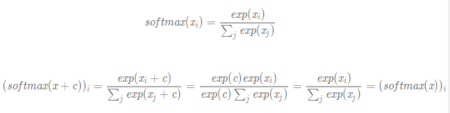
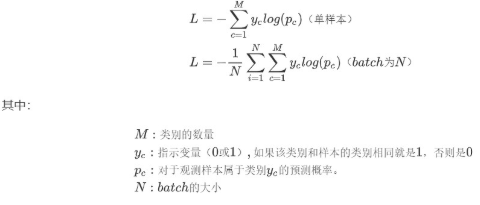
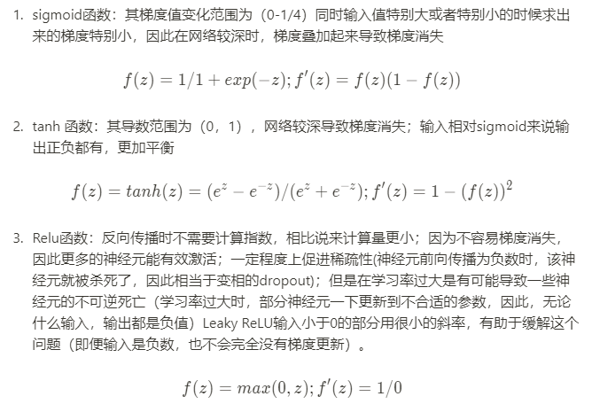
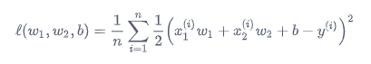
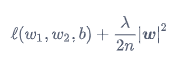
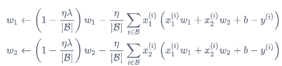
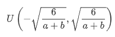

[01_线性回归](#线性回归)

[02_Softmax分类模型](#分类模型和softmax)

[03_多层感知机](#多层感知机)

[04_模型选择（过拟合&欠拟合的出现和解决）](#模型选择（过拟合&欠拟合的出现和解决）)

[05_数值稳定性与模型初始化](#数值稳定性与模型初始化)


# Hands on deep learing 动手学深度学习笔记
每节课分为两部分，一部分记录部分知识点和探索的问题，另一部分记录代码和代码相关的笔记
每节课都会有代码，但是只有部分课会有笔记

代码来自于伯禹教育平台的[ElitesAI·动手学深度学习PyTorch版](https://www.boyuai.com/elites/course/cZu18YmweLv10OeV)

笔记总结于课程中的思考和课程讨论区


------------------------------

# 线性回归

* 定义：基于特征和标签之间的线性函数关系约束，线性回归通过建立单层神经网络，将神经网络中每一个神经元当成是函数关系中的一个参数，通过利用初始输出和目标输出建立损失，并优化损失最小的方式使得神经元的数值和真实函数参数数值最相近，从而通过网络训练得到最符合数据分布的函数关系。

* 实施步骤：
1. 初始通过随机化线性函数的参数，通过输入的x，会得到一系列y_h
2. 输出的y_h和真实值y之间因为神经元参数不正确产生差距，为了y_h和y能尽量地逼近，我们通过平方误差损失函数（MSE Loss）来描述这种误差。
3. 类似于通过求导得到损失函数最优解的方式，我们通过梯度下降法将这种误差传递到参数，通过调整参数使误差达到最小
4. 通过几轮的训练，我们得到的最小的损失值对应的神经元数值，就是描述输入输出的线性关系的最好的参数。

* 要点：
1. 确定输入输出之间一定满足线性关系，这一点可以通过对x,y画图看出，只有线性关系才能使用线性回归训练得到
2. 由于线性关系唯一由神经元个数决定，不同的参数个数唯一决定了这种线性关系，因此需要选择适合的特征用于线性回归

## 这一节中出现的有用的函数
1. 使用plt绘制散点图

```python
from matplotlib import pyplot as plt
plt.scatter(features[:, 1].numpy(), labels.numpy(), 1)
```
2. 自行制作dataLoader: dataloader 为输入dataset可以随机获取dataset中batch size 个样本
> 通过使用打乱的indices，每次yield batch size个样本，生成的生成器可以用for调用
```python
def data_iter(batch_size, features, labels):
    num_examples = len(features)
    indices = list(range(num_examples))
    random.shuffle(indices)  # random read 10 samples
    for i in range(0, num_examples, batch_size):
        j = torch.LongTensor(indices[i: min(i + batch_size, num_examples)])
        # the last time may be not enough for a whole batch
        yield  features.index_select(0, j), labels.index_select(0, j)
```
3. 参数初始化：自行初始化网络中的参数，使用init模块
```python
from torch.nn import init

init.normal_(net[0].weight, mean=0.0, std=0.01)
init.constant_(net[0].bias, val=0.0)
```


## 重要的问题：
### 1.构建一个深度学习网络并训练需要哪些步骤？

深度学习网络的主要组成部分就是数据，网络和训练，因此可以根据这三部分展开为下面几个步骤：

#### 0. 数据部分
1. 生成数据集/找到现有数据集
2. 根据数据集构建Dataset 并用之构建dataloader
3. （可选）调用构建的Dataloader，得到数据并可视化，检查实现的正确性，并对数据有一定了解

#### 1. 网络部分
4. 定义模型，初始化模型参数
5. 定义损失函数，如本节的MSE loss
6. 定义优化函数，SGD,Adam... 及其参数：学习率，动量，weight_decay...

#### 2. 训练部分
7. 使用循环的方式，每个循环训练一遍所有数据
8. 将数据输入网络，根据损失函数和网络输出建立损失
9. 梯度清零，损失回传，优化器更新损失
10. 记录损失，可视化结果，往复训练

### 2.什么时候该用parameter.data?
下面是课程中使用的优化器的代码，可以发现，参数的更新使用了param.data
```python
def sgd(params, lr, batch_size): 
    for param in params:
        param.data -= lr * param.grad / batch_size # ues .data to operate param without gradient track
```
根据我的理解，这是由于反向传播机制在需要更新的参数进行运算时会构建动态运算图，如果直接使用这个`param`进行更新，就会在动态图中计入这一部分，从而反向传播时也会将这一步运算的梯度加入。而我们实际希望的则是损失函数对参数进行求导，而不希望再此参数上“节外生枝”。因此，在网络前向传播和损失函数计算之外的参数运算，应当使用param.data进行更新


-------------------------

# 分类模型和softmax
_定义_：softmax是用于将向量输出统一为有概率性质的一个函数，基于其指数的性质，它可以拉大大数和小数之间的差距，并且越大的数，为了达到和较小的数的差距只需要更小的差距，有助于筛选出一组向量中的最大值，并使其和其他数更加明显区分。

_性质_: softmax函数的常数不变性，即 softmax(x)=softmax(x+c)：对需要进行softmax变换的向量，同时减去一个较大的数不会对结果产生影响，推导如下：


<div align=center>  

   

</div>


优势：1. 通过softmax，输入向量每个元素的大小一目了然，不需要关心输出的具体数值，也不会存在输出相差较大时，不好比较的问题
2. 使用softmax的输出进行交叉熵函数的比较相当于统一了量纲，平衡了不同输出结果的重要程度


## 分类模型
_定义_：分类模型用于将输入的图片/信号进行分类，本单元讲到的分类模型是对输入进行一次线性变换，最后将分类结果利用softmax进行区分，示例如下图：


<div align=center> 

 

</div>

_交叉熵函数_：上节的回归问题，我们用到了MSE，因为我们希望线性模型的参数和真实的完全一致，但是在分类模型中，我们只希望真实类别对应的概率越大越好，其他概率的具体数值对损失并没有过多含义。因此，这里使用了交叉熵函数，通过将标签化为one-hot编码，使得损失函数只关注正确类别对应的概率大小,其函数表达和实例操作如下：
<div align=center> 

 

</div>

如果标签为one-hot编码且只有一个正确类别，那么最小化交叉熵损失就是最大化正确类别对应输出概率的log形式，从另一个角度来看，最小化交叉熵损失函数等价于最大化训练数据集所有标签类别的联合预测概率

----------------------------

# 多层感知机
_定义_：多层感知机是采用多个神经网络层，并在其中添加了非线性单元，从而使得网络可以得到从输入到输出的非线性映射，从而将线性模型转化为非线性模型，在此基础上，增加网络的深度可以进一步增加网络的复杂度。

## 激活函数：
_定义_：拥有非线性部分的函数，即函数的导数并非处处一致，常见的激活函数有Relu，Leaky-relu，tanh，sigmoid等

实例：


<div align=center>  



</div>


## 重要的问题：
### 1. 不同的激活函数应当如何选择？
在考虑不同激活函数的区别和优势时，我们主要考虑激活函数对神经元输出的影响和神经元的数值更新的能力。（即神经元的存在以及学习能力）

*神经元的存在问题*：当一个神经元更新到无论什么参数输入，其输出均为零时，其就失活了。这个主要是因为某些激活函数的截断作用，当大量神经元失活，网络的复杂度就会受到严重影响

*神经元参数的更新*：其取决于反向传播到该神经元的梯度值，这个梯度值是累乘的，其会乘上激活函数的梯度。因此，如果激活函数的梯度过小，那么就会导致这个神经元学习缓慢/无法学习


* Relu：由于其计算效率和不容易梯度消失，从而大多数情况下使用；但是，由于其输出范围不确定，因此只能在隐藏层中使用；同时Relu函数因为在小于0的部分为0，因此容易在学习率大时使神经元失活

* Sigmoid函数：用于分类器时，通常效果更好，但是存在由于梯度消失。

* Tanh 函数: 和sigmoid 相似，但是其导数输出在（0，1），相比sigmoid更容易激活神经元；也存在梯度消失的问题


------------------
# 模型选择（过拟合&欠拟合的出现和解决）
我们在训练深度学习模型时，期望使用训练数据训练的这个模型能在测试数据上也能得到很好的表现，这个就是期望泛化误差减小。（_泛化误差:_ 模型在任意测试数据上的输出结果和真实结果的差距的期望，通常使用测试集上的误差来代表）

为了得到这样一个模型，其中的主要影响因素是模型复杂度，输入数据量，训练时间，训练方法等。但是由于我们没有确切的方式定义这些因素是如何影响的，因此，我们需要各种各样的方法来选择模型。

## 模型选择的方法
选择模型时，我们主要参考两个指标。一个是训练误差，一个是验证误差，这里不能使用泛化误差是因为这样会导致泛化误差有偏，不能反映真实的泛化误差。
训练误差和验证误差分别是模型在训练数据集和验证数据集上的误差，这个误差可以用交叉熵损失函数，MSE损失函数等多种损失函数计算得出
* 验证数据集进行验证：
验证集通过在整体数据中抽出一定比例数据组成，其不参与模型的训练过程，在模型使用训练数据训练完成后，我们通过其在验证集上的精度进行模型的选择。
* k折验证法：
有时，我们的数据不是非常充足，因此为了减少验证集对数据的浪费，我们采用K折验证法：
   1. 我们将整个数据分成k份，其中（K-1）份代表训练集，1份代表验证集，同时我们要遍历所有的组合方式，也就生成K份不同的数据集
   2. 模型分别基于K份数据集中的训练集进行训练，对应的验证集进行验证，获得的验证精度进行平均即获得这个模型的精度。

## 训练模型的过拟合和欠拟合
训练出来的模型一般存在两类问题，导致最终的验证结果不是最理想，因此我们需要尽量避免。
<div align=center>  


</div>

_欠拟合_：训练误差无法达到较小，说明此时在训练数据上模型都不能正确拟合。
_过拟合_：当训练误差已经较小，但是验证误差和训练误差相差较大，说明模型仅仅拟合到训练数据，该模型并不能泛化。

影响欠拟合和过拟合的因素：
影响模型有没有拟合/过拟合的因素是多方面的，包括模型模型复杂度，数据量，训练时间，训练方法等。
* 模型复杂度：模型复杂度可以受到参数量，网络的广度深度的影响，其最终等效为这个模型能描述的所有的函数的集合。一个过大的模型在一定时间的训练下很容易过度拟合
* 数据量： 数据量不仅仅是数据的多少，其还应该具有足够代表性和多样化。
* 训练时间&训练方法：合适的训练方法和恰当的训练时间可以避免模型过拟合/欠拟合


### 过拟合和欠拟合的解决方法
为了解决过拟合/欠拟合，我们需要对模型的复杂度进行限制/增加更多的数据，下面提出两种解决过拟合的方法
* 权重衰减和正则化：
    在使用SGD优化方法时，正则化和权重衰减具有一致性。其中L2正则化是在模型的损失上添加一个权重的二范数作为惩罚项，从而限制参数的大小。
    具体表达式以线性回归模型的损失函数为例：
    <div align=center>  
    
    

    </div>

    正则项则是参数的二范数:
    <div align=center>  
    
    

    </div>

    最终，根据SGD的参数更新方式，我们可以得到如下更新公式：
    <div align=center>  
    
    

    </div>

    可以发现，添加了L2正则项的损失函数促使更新公式在权重项之前乘以了一个小于1的系数，也就是等效于权重衰减设置为lr*lambda

* inverted dropout 丢弃法：

   dropout的思想是在前向传播的时候，设置一概率p，使得每个神经元有p的概率输出为0，很明显，这样的方式可以达到网络稀疏化的效果，从而削弱了网络的表达能力，即复杂度。从而是一种有效的防止过拟合的方式，下面我们看看其具体是怎么运行的：
    
    1. 在前向传播的时候，设置一个存在权重n，其有p的概率为0，1-p的概率为1，从而一个神经元输出为：

       这里我们发现其输出的期望还是等于自身：
    
       也就是增加了dropout的网络的输出平均值与没有增加dropout一致，而我们又知道dropout每次代表不同的网络结构，因此对增加了dropout的网络输出求平均即为对不同网络结构求平均，这样我们实现了一个网络结构和一次训练，但是求出的平均值等效于同时训练多个网络得到的平均值。这一种方法也有效地减少了过拟合。
    
    2. 在训练过程中我们不断使用不同的数据重复上述步骤
    
    3. 我们在测试是去除缩放因子，并对网络进行测试，由于第一步我们知道添加dropout与否的网络的平均值相同，那么我们在测试时去除缩放因子就保证了和训练的平均值相同。即我们测试了我们训练的网络。
   
   那么dropout在网络结构层次上又是怎么影响的呢？
   其作者认为，在训练神经网络时，过拟合现象起源于神经元之间的co-adpatation 相互适应，也就是某个神经元在给定某些固定特征时，其强行根据一些不正确的特征组合出最终的正确答案，因此dropout就打破了特征和输出的固定联系，从而促使网络根据一个更加general的场景做决定。

------------
# 数值稳定性与模型初始化
通常我们希望我们的模型在训练过程中能快速地学习并在学习之后收敛到一个较好的结果。因此网络的数值稳定性就格外重要，我们希望网络中的神经元能每次更新适当大小的梯度作为优化方向。而梯度消失和梯度爆炸则会导致上述训练停滞或不能收敛。
> 深度模型有关数值稳定性的典型问题是衰减和爆炸。当神经网络的层数较多时，模型的数值稳定性容易变差。

_梯度消失_：其指的是传递到很多神经元的梯度几乎为0，从而导致网络的学习停滞

_梯度爆炸_：对应于梯度消失，梯度爆炸则代表神经元的梯度过大，使得其一下更新到一个不合适的位置，从而网络不能收敛

## 导致梯度消失和梯度爆炸的原因：
1. 神经网络没有很好地初始化：当我们假设神经网络没有激活层时，传递到某一个神经元的梯度就是其后方连接上所有神经元参数的连乘积。那么，在较深的网络中如果我们将神经元均初始化较大（>1）的数值会导致梯度爆炸，较小（<1）则会导致梯度消失
那么有激活函数的场景怎么样呢，有激活函数时，不同的损失函数的情况有所不同，对于Sigmoid激活函数，当参数初始化较小的值，神经元的输入会较小，此时激活函数对应的梯度也较小，由此影响到神经元的梯度也较小，从而造成了梯度消失。
2. 没有选择恰当的激活函数：如第一点所述，不同的激活函数会对梯度消失和梯度爆炸产生影响，因此需要根据数据选择合理的激活函数
3. 输入没有合理地归一化：影响激活函数梯度的除了其自身之外，还有其输入，即便神经元初始正常，没有归一化的输入也会导致神经元输出过大/小，从而激活函数梯度过小

## 神经元初始化的方法
根据上述阐述，我们知道神经元的权重应当初始化到一个1附近的数值/0附近（对于Sigmoid等激活函数来说），因此有各种各样的初始化方法，在pytorch里面可以通过torch.init调用
1. Xavier初始化：将权重参数初始化到：
    <div align=center>  
    
    

    </div>

根据均匀分布的均值和方差公式，我们可以知道其初始化后，均值为0，方差为2/（a+b）

